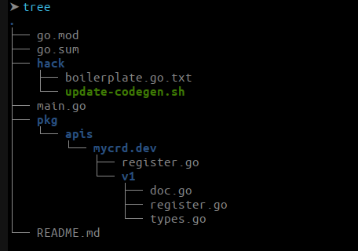

# k8s-sampleController

This particular example demonstrates how to perform basic operations such as:

* How to register a new custom resource (custom resource type) of type `AppsCode` using a CustomResourceDefinition.

It makes use of the generators in [k8s.io/code-generator](https://github.com/kubernetes/code-generator) to generate a typed client, informers, listers and deep-copy functions. You can do this yourself using the  `./hack/update-codegen.sh` script.

- At First Set your apis Group && Version Name and Create files and directory be like:

    -

* Give Permission:

  * `chmod +x hack/update-codegen.sh`
  * `chmod +x vendor/k8s.io/code-generator/generate-groups.sh`
* run script: `./hack/update-codegen.sh`
* Update-codegen script automatically generate

  * zz_generated.deepcopy.go
  * clientset
  * lister
  * informers
* ### Run Controller:

  * `./usage/run.sh`
  * Now you expose your api server outside
  * See what controller makes for me:
    * `kubectl get svc`
    * `kubectl get deploy`
    * `kubectl get pods`
  * Clean all resources/objects: `./usage/clean.sh`

### Resources:

* The sample controller  [client-go library](https://github.com/kubernetes/client-go/tree/master/tools/cache) extensively.
* [How to Write controller](https://github.com/kubernetes/community/blob/master/contributors/devel/sig-api-machinery/controllers.md)
* k8s Custom Controllers:

  * [Link1](https://www.linkedin.com/pulse/kubernetes-custom-controllers-part-1-kritik-sachdeva/) [Link2](https://www.linkedin.com/pulse/kubernetes-custom-controller-part-2-kritik-sachdeva/)
* Informer, Cache, queue:

  * [https://www.youtube.com/watch?v=soyOjOH-Vjc&amp;list=PLh4KH3LtJvRTb_J-8T--wZeOBV3l3uQhc&amp;index=4](https://www.youtube.com/watch?v=soyOjOH-Vjc&list=PLh4KH3LtJvRTb_J-8T--wZeOBV3l3uQhc&index=4)
* The Life of a Kubernetes Watch Event:

  * [https://www.youtube.com/watch?v=PLSDvFjR9HY](https://www.youtube.com/watch?v=PLSDvFjR9HY)
*
